  

[;Native+Android+(Kotlin+%26+Compose)+%2B+Modern+Web;Edge+AI+%26+On-Device+Neural+Architectures)](https://git.io/typing-svg)

 

  
  
  
  

---

### 👨‍💻 About Me

I am a 3rd-year **Artificial Intelligence & Data Science** undergraduate at **QIS College of Engineering & Technology**, passionate about engineering robust, end-to-end intelligent systems. My technical spectrum spans **Full-Stack Web Engineering**, **High-Performance Native Android (Jetpack Compose)**, and **Edge AI / TinyML**.

- 🌐 **Full-Stack Development**: Engineering end-to-end web architectures, reactive client frontends, RESTful APIs, and scalable cloud deployments (e.g., [Skilloriax](https://skilloriax.in)).
- 🛰️ **Smart India Hackathon (SIH 2026)**: Core contributor to **iTantra** (ISRO PS #173) — an offline, edge-capable multilingual neural transceiver radio with on-device speech processing (STT/TTS).
- 📱 **Native Android & Systems**: Developing responsive, modern Android applications including **IrahMusic** (audio streaming engine) and **QIS CORTEX** (campus intelligence system).
- 🛡️ **Capstone Lead**: Architecting **Project Aegis** — an AI-powered robotic IoT fall detection and telemetry health monitoring system.
- 🧠 **Edge AI & Research**: Deploying on-device neural inference (ONNX, PyTorch Mobile, DSP) and exploring autonomous agentic workflows.

---

### 🛠️ Tech Stack & Arsenal

<table>
  <tr>
    <td align="center" width="96">
      
       <b>JavaScript</b>
    </td>
    <td align="center" width="96">
      
       <b>TypeScript</b>
    </td>
    <td align="center" width="96">
      
       <b>React</b>
    </td>
    <td align="center" width="96">
      
       <b>Node.js</b>
    </td>
    <td align="center" width="96">
      
       <b>HTML5</b>
    </td>
    <td align="center" width="96">
      
       <b>CSS3</b>
    </td>
  </tr>
  <tr>
    <td align="center" width="96">
      
       <b>Kotlin</b>
    </td>
    <td align="center" width="96">
      
       <b>Python</b>
    </td>
    <td align="center" width="96">
      
       <b>Java</b>
    </td>
    <td align="center" width="96">
      
       <b>C++</b>
    </td>
    <td align="center" width="96">
      
       <b>SQL</b>
    </td>
    <td align="center" width="96">
      
       <b>Tailwind</b>
    </td>
  </tr>
  <tr>
    <td align="center" width="96">
      
       <b>Android SDK</b>
    </td>
    <td align="center" width="96">
      
       <b>Compose</b>
    </td>
    <td align="center" width="96">
      
       <b>PyTorch</b>
    </td>
    <td align="center" width="96">
      
       <b>OpenCV</b>
    </td>
    <td align="center" width="96">
      
       <b>Git</b>
    </td>
    <td align="center" width="96">
      
       <b>Linux</b>
    </td>
  </tr>
</table>

 

**Focus Disciplines:**
`Full-Stack Web Architecture` • `REST APIs & Cloud Services` • `Edge AI / TinyML` • `Deep Learning` • `Android Jetpack Compose` • `Robotic IoT Systems` • `Autonomous AI Agents`

---

### 🚀 Highlighted Repositories & Systems

| Project | Description | Core Stack |
| :--- | :--- | :--- |
| **🌐 [Skilloriax Platform](https://skilloriax.in)** | Full-stack platform deployment, responsive UI architecture, and cloud production infrastructure. | `React`, `Node.js`, `REST APIs`, `Vercel Cloud` |
| **🛰️ [iTantra (SIH '26)](https://github.com/harinath4496)** | Offline multilingual neural transceiver radio with edge speech synthesis & recognition (ISRO PS #173). | `Python`, `ONNX`, `DSP`, `Radio Hardware` |
| **🎵 [IrahMusic](https://github.com/harinath4496/IrahMusic)** | Fluid, high-performance native Android music streaming & playback application. | `Kotlin`, `Jetpack Compose`, `AndroidX Media3` |
| **🤖 [Agentic AI on Android](https://github.com/harinath4496/AGENTIC-AI-IN-ANDROID)** | Autonomous agentic AI workflows and LLM orchestration on mobile devices. | `Android`, `Kotlin`, `AI Agents`, `LLM` |
| **🛡️ [Project Aegis](https://github.com/harinath4496)** | AI-driven robotic IoT fall detection and remote health telematics monitor with vision inference. | `IoT`, `OpenCV`, `Microcontrollers`, `Python` |
| **📱 [QIS CORTEX](https://github.com/harinath4496)** | Offline-first campus intelligence platform with dynamic timetable detection and compliance radar. | `Kotlin`, `Android`, `Material3`, `Room DB` |
| **💻 [Portfolio Website](https://github.com/harinath4496/portfolio-Nothing)** | Responsive personal portfolio showcasing full-stack capabilities, UI engineering, and design. | `HTML5`, `CSS3`, `JavaScript`, `Animations` |

---

### 📊 GitHub Activity & Metrics

  
  

 

  

---

  <b>“Building the bridge between intelligent algorithms, modern web, and edge realities.”</b> 
  <i>Always open to collaborating on innovative Full-Stack, AI, and Android systems!</i>

