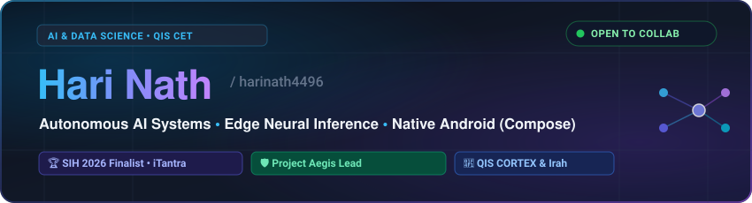

<div align="center">



</div>

<br/>

### About

Undergraduate in **Artificial Intelligence & Data Science** at **QIS College of Engineering & Technology** (2023–2027).

Focused on engineering at the intersection of on-device neural inference and native systems—optimizing lightweight models for edge hardware and developing responsive, offline-first Android applications.

Currently building:
* **iTantra** — Offline multilingual neural transceiver radio with on-device speech processing (ISRO PS #173, Smart India Hackathon 2026).
* **Project Aegis** — Autonomous robotic IoT fall detection and vitals telemetry monitor.
* **QIS CORTEX** — Offline-first campus intelligence platform with dynamic schedule radar.
* **IrahMusic** — High-performance native Android music streaming client.

---

### Focus & Systems

```text
Languages & Runtime    : Kotlin, Python, C++, Java, SQL
On-Device & Neural     : ONNX Runtime, PyTorch Mobile, OpenCV, DSP, Speech (STT/TTS)
Mobile Engineering     : Android SDK, Jetpack Compose, Coroutines, Room DB, ExoPlayer
Embedded & Systems     : IoT Telematics, Microcontrollers, Offline-First Architecture
```

---

### Selected Projects

| Project | Domain | Architecture / Stack |
| :--- | :--- | :--- |
| **[iTantra](https://github.com/harinath4496)** | Edge Transceiver Radio | Python, ONNX, DSP, RF Transceiver Hardware |
| **[Project Aegis](https://github.com/harinath4496)** | Robotic IoT & Telematics | Computer Vision, IoT Sensors, Microcontrollers |
| **[QIS CORTEX](https://github.com/harinath4496)** | Campus Systems | Kotlin, Jetpack Compose, Room SQLite |
| **[IrahMusic](https://github.com/harinath4496/IrahMusic)** | Native Media Client | Kotlin, Compose, AndroidX Media3 |
| **[AGENTIC-AI-IN-ANDROID](https://github.com/harinath4496/AGENTIC-AI-IN-ANDROID)** | On-Device Agents | Kotlin, Android SDK, LLM Edge Pipelines |

---

<div align="center">

```text
github.com/harinath4496  ·  harinath4496@gmail.com  ·  Ongole, AP, India
```

</div>
